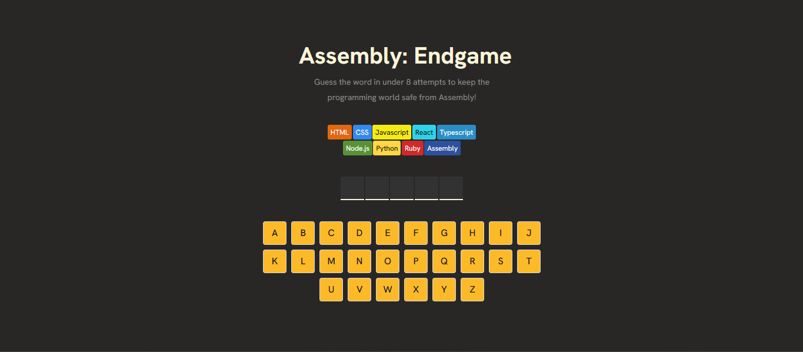

# Assembly End Game

A word-guessing challenge where you have a limited number of attempts to save a list of programming languages — or the last one, *Assembly*.
Guess the word in under **8 attempts** to keep the programming world safe from Assembly!

---

## 🎮 Overview

**Assembly End Game** is a fun, hangman-style word guessing game built with React.
The goal is simple — guess the hidden word letter by letter using your keyboard (on-screen or physical) before you run out of attempts.
Each wrong guess costs you a “language” — once you lose them all, it’s *Game Over*.

---

## 🖼️ Screenshot



---

## ✨ Features

* Guess letters using both **on-screen buttons** and your **physical keyboard**
* **Limited attempts** — every wrong guess brings you closer to losing
* Displays correct and incorrect guesses with **color feedback**
* A **reset button** to start a new round anytime
* Fully functional **win/lose detection**
* Smooth and **responsive gameplay** built with React

---

## 🧰 Built With

* **React** – component-based UI
* **Plain CSS** – for custom styling and responsiveness
* **Netlify** – for deployment 

---

## ⚙️ Getting Started

Follow these steps to run the project locally:

```bash
# Clone this repository
git clone https://github.com/yourusername/assembly-end-game.git

# Navigate to the project directory
cd assembly-end-game

# Install dependencies
npm install

# Run the development server
npm run dev
```

The game will run on `http://localhost:5173/` (or the URL shown in your terminal).

---

## 🧠 What I Learned

* Managing **keyboard events** effectively in React
* Synchronizing input between **click and key events**
* Improving understanding of **React state updates** and event listeners
* Practicing clean code through **custom hooks** and **component separation**

---

## 🚀 Future Improvements

* Add **sound effects** and **animations**
* Include **difficulty levels** (Easy / Hard)
* Add **score tracking** or **timer mode**
* Create a **leaderboard** using local storage

---

## 🔗 Live Demo

[**Live Site**](https://assembly-end-game-hangman.netlify.app/)

---

## 🧑‍💻 Author

**Nurudeen Hamzah**
Fullstack Developer
[GitHub](https://github.com/HamDean)
